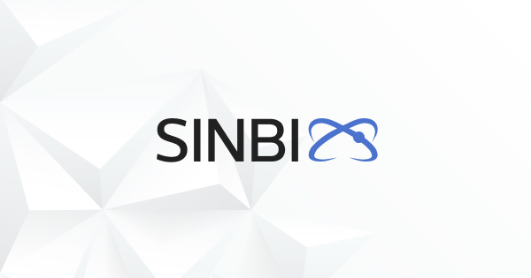

<!-- #  -->


Sinbix is ​​a monorepository that aims to provide an advanced solution for collaborative development of many different projects.

This monorepository is based on Nx (Angular Workspace), where its main difference is getting rid of highly specialized concepts: more opportunities for different types of projects and their location.

In Sinbix, any projects can be located in any directory, while Nx limits the developer to a maximum of two directories (usually apps, libs), which creates great inconvenience with a very large number of projects. And the core of the «Sinbix» mono-repository is not connected with the types of projects developed in it, programming languages ​​or any technologies in general, which in the future will allow using Sinbix for convenient development of projects in various directions.

In addition to everything, this mono-repository is used to develop oneself, which is not fully implemented not in Nx, not in Angular (monorepository). And this, in turn, creates additional difficulties in their further modifications.

This Sinbix repository contains over 40 projects

## Demo

Directory «[demo](demo)» сontains an example of a large client-server project developed according to the Sinbix concept.

This project includes: NestJS server applications built on a microservice architecture, as well as hybrid cross-platform Angular client applications. Several Nats message brokers and databases like Postgresql and mongodb with imaginary linkage between them (сascade delete implemented).

Attention: the development of NestJS and Angular applications takes place using a special architectural approach created by the author. Thanks to it, all independent applications can use the common elements of the mono-repository with each other as efficiently as possible (modules, components, services, gateways, interfaces, validators, components, etc.).

### Run the demo

You must have docker installed

You must have free ports: 3333, 4200, 4222, 5222, 5432, 8080, 8081, 27017

```
$ git clone https://github.com/sinbix/sinbix.git
$ cd sinbix
$ npm i -g sinbix
$ npm i
$ sinbix serve
```

## E2E

Directory «[e2e](e2e)» contains user-level stand-alone testing projects.

## Packages

Directory «[packages](packages)» contains published packages (Angular, NestJS, Node).

## Plugins

Directory «[plugins](plugins)» Contains completely rewritten Nx plugins that define specific functionality for a mono-repository Sinbix (based on Angular Devkit - Builders, Schematics).

## Shared

Directory «[shared](shared)» contains shared libraries (The logo used in many projects in the repository, including this readme.md file).

## Sinbix

Directory «[sinbix](sinbix)» contains elements of the repository itself.

Currently, most of the code in this directory is borrowed from Nx. But there are also significant changes. For example, a regular web application of a dependency diagram executed in plain TypeScript was completely rewritten by the author in Angular (Material).
